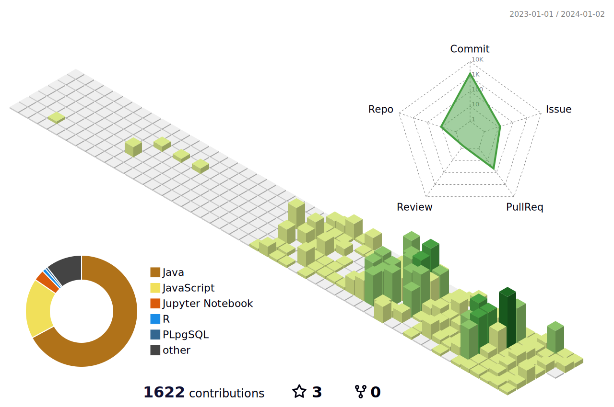

# Hello World! I'm Peter 😆
    
**Welcome to my page,         
where dreams come true.**
 
 

### I’m currently learning 💩
<!---->

<!---->
<!---->
<!---->
<!--

-->

<!---->
<!---->
<!---->
<!--
### Capable of 💪

 
 

 -->

### How to reach me 🙋

 
<!---->

  

